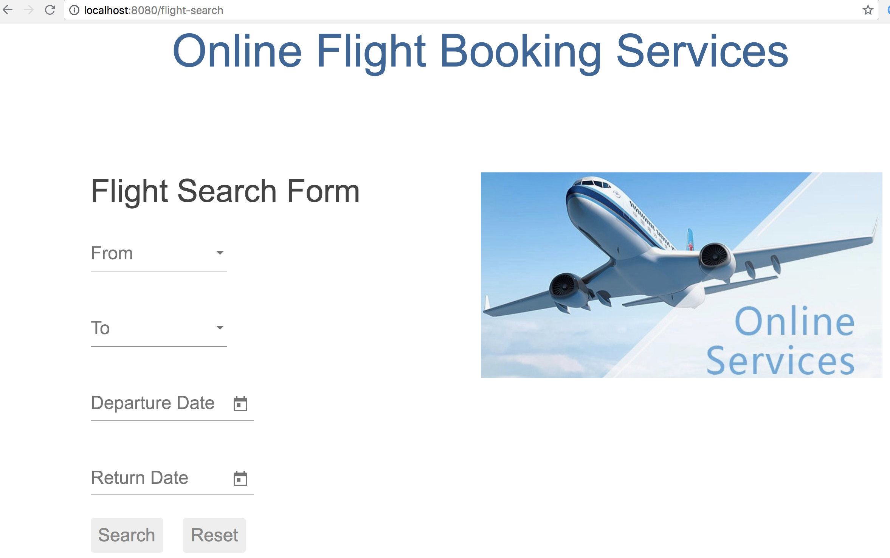

This article describes how to secure an application using Spring security OAuth2
generation-one. The sample consists of an Angular front-end application
and a couple of Spring boot based backend services. Both frontend application
and backend services are behind an edge proxy that assumes the responsibility
to authenticate and authorize a user. Spring Cloud common services such as
spring cloud configuration and spring cloud Eureka registry services are used.

## Architecture
----


All components are behind an edge proxy service. Spring Cloud Zuul is used as
the edge service. A user launch the application using a route to the landing
index page of the front-end UI application. The front-end UI is implemented as
an Angular-based separate project that compiled and packaged into a spring-boot
application. The front-end UI application reaches out to a backend reservations
service through the edge proxy. The reservations services in turn seeks flights
information by routing via the edge proxy to another backend flights data service.

This architecture enables us to have the following:

1- Communications between all modules to go through an edge-service to centrally
manage security, logging and other common concerns

2- Use of authentication token relay between edge proxy service and front-end UI application

3- Use of Spring Feign to communicate between the two backend services

4- Use of a Feign intercepter to inject authentication token when communicating
to a downstream backend Flights data service.

## Services Configuration
----

Spring Cloud Config Server is used externalize all modules configurations.
For easy launching, the configuration server launches with a native profile to
leverage a local backend storage to keep the "yml" properties files.

With the appropriate dependencies, you can create a configuration server as
a regular spring boot application by enabling the server with "@EnableConfigServer"
annotation.

``` java
@SpringBootApplication
@EnableConfigServer
public class ConfigServerApp {

	public static void main(String[] args) {

		SpringApplication.run(ConfigServerApp.class, args);
	}
}
```

One can start the configuration server with the following settings:

```yml
spring:
  profiles: native
  cloud:
    config:
      server:
        native:
          searchLocations: file:///[path-to-yml-files]
```

As in this sample, you can keep all the "yml" configuration files in some local
storage path:


Each configuration file is named after the name of the corresponding configured
application and as defined by "spring.application.name" property in that application.

This application name and the configuration service's URL are
defined in each application's "bootstrap.yml" file inside the "resources" folder.
For instance, the flights data service would have a "bootstrap.yml" file with a
content such as:

```yml
spring:
  application:
    name: flights-service
  cloud:
    config:
      fail-fast: true
      uri: http://localhost:8888
```


## Services Registration and Discovery
----

Spring Cloud Eureka is used for services registration and discovery. It is also
created with its appropriate dependency as a regular spring boot application.
We only need to annotate the application class with "@EnableEurekaServer"

```java
@SpringBootApplication
@EnableEurekaServer
public class RegistryServerApp {

	public static void main(String[] args) {
		SpringApplication.run(RegistryServerApp.class, args);
	}
}
```

and set it such that it would not register itself.

```yml
eureka:
  client:
    register-with-eureka: false
    fetch-registry: false
```

## OAuth2 Authorization Server
----

Creating an OAuth2 authorization server is simple using Spring security and
OAuth2 dependencies

```xml
<dependency>
	<groupId>org.springframework.boot</groupId>
	<artifactId>spring-boot-starter-security</artifactId>
</dependency>
<dependency>
	<groupId>org.springframework.security.oauth</groupId>
	<artifactId>spring-security-oauth2</artifactId>
</dependency>
```

As listed in the repo, a configuration class is added with
"@EnableAuthorizationServer" annotation.

```java
@Configuration
@EnableAuthorizationServer
public class AuthorizationServer extends AuthorizationServerConfigurerAdapter {
  ...
}
```

A client in this class is defined with Id as "acme", secret as "acmesecret",
different grant types and scopes as "openid". You can optionally set the scopes auto-approval.

To enable resource servers (backend services) to decode the authorization tokens,
this server exposes a "../user" endpoint that exposes an authenticated principal.

As configured, users authenticate using a login form mechanism

```java
@Configuration
public class WebSecurity extends WebSecurityConfigurerAdapter {

    @Override
    protected void configure(HttpSecurity http) throws Exception {
        http.authorizeRequests()
                .anyRequest().authenticated()
                .and()
                .formLogin().permitAll();
    }
}
```

Although its also appropriate to apply an "Implicit" OAuth2 flow in single page
applications, in this illustration example, we will be exercising OAuth2
"authorization_code" flow.

## Front-End UI Application
----

UI application is implemented using Angular (6). A simple spring boot
project is also created to serve the client UI application. In order
to build the Angular module into the spring boot project, a maven plugin is used
to run "ng build" command during the "validate" stage and direct the output to
the spring boot "resources" folder.

``` xml
<plugin>
  <groupId>org.codehaus.mojo</groupId>
  <artifactId>exec-maven-plugin</artifactId>
  <version>{version}</version>
	<executions>
		<execution>
			<phase>validate</phase>
			<goals>
				<goal>exec</goal>
			</goals>
		</execution>
	</executions>
	<configuration>
		<executable>ng</executable>
		<workingDirectory>../agency-ui</workingDirectory>
		<arguments>
			<argument>build</argument>
			<argument>--output-path</argument>
			<argument>../agency-frontend/src/main/resources/static</argument>
		</arguments>
	</configuration>
</plugin>
```

This UI client application represents one of the secured resources behind the
edge proxy, it also registered in Eureka to be discovered and routed by the proxy.
Therefore, a configuration class marked with "@EnableResourceServer"
annotation is added to authorize access to the client application while allowing
some of its "actuator" administration endpoints that are needed by Eureka's health
checking.

``` java
@Configuration
@EnableResourceServer
public class ResourceServerConfig extends ResourceServerConfigurerAdapter {

    @Override
    public void configure(HttpSecurity http) throws Exception {
        http
                .requestMatcher(new RequestHeaderRequestMatcher("Authorization"))
                .authorizeRequests()
                .antMatchers("/admin/info", "/admin/health/**").permitAll()  // allow actuator endpoints
                .anyRequest().authenticated();
    }
}
```

## Resource Servers / Back-End Services
----

There are two resource servers as backend services. A reservation service that
helps to search flights, perform booking and issue confirmations. In order to
perform its function, this service utilizes a downstream flights service that
only acts as data-as-a-service to retrieve information from a database of flights
information.

The reservation service uses Spring Cloud Feign as a client to interact with the
flights data service.

### Flights data service

Flights data service is implemented using Spring Data to retrieve flights information
from a backend database (H2). Spring Data Rest is used to expose Flight search
results. One can search a flight passing in an origin airport, destination
airport, besides travel and return dates.

``` java
@RepositoryRestResource(collectionResourceRel = "flights", path = "flights")
public interface FlightRepository extends PagingAndSortingRepository<Flight, Long> {

	@RestResource(path = "datedlegs", rel = "datedlegs")
	@Query("SELECT f FROM Flight f WHERE f.origin = ?1 AND f.destination = ?2 "
			+ " AND f.departure between ?3 and ?4")
	public List<Flight> findFlightsByCustomQueryDated(@Param("origin") String origin,
			@Param("destination") String destination,
			@Param("mindate") @DateTimeFormat(pattern = "yyyy-MM-dd") Date mindate,
			@Param("maxdate") @DateTimeFormat(pattern = "yyyy-MM-dd") Date maxdate);

...
}
```

This service is also an OAuth2 secured resource server that includes same OAuth2
dependencies and "ResourceServerConfig" configuration class as in the Client
application.

### Reservations service

The reservation class is a Spring Boot application that exposes "/search" and
"/book" endpoints in a RestController. As a secured OAuth2 resource server, this
service includes same OAuth2 dependencies and "ResourceServerConfig" configuration
class as in the Client application.

To pass the authorization token of an authenticated client downstream when using
a Feign client, this service includes a "RequestInterceptor" to inject the token
in a header of the "RequestTemplate".

``` java
@Component
public class FlightClientInterceptor implements RequestInterceptor {
    private static final String AUTHORIZATION_HEADER = "Authorization";
    private static final String BEARER_TOKEN_TYPE = "Bearer";

    @Override
    public void apply(RequestTemplate template) {
        SecurityContext securityContext = SecurityContextHolder.getContext();
        Authentication authentication = securityContext.getAuthentication();

        if (authentication != null && authentication.getDetails() instanceof OAuth2AuthenticationDetails) {
            OAuth2AuthenticationDetails details = (OAuth2AuthenticationDetails) authentication.getDetails();
            template.header(AUTHORIZATION_HEADER, String.format("%s %s", BEARER_TOKEN_TYPE, details.getTokenValue()));
        }
    }
}
```

## Edge Proxy
----

Spring Cloud Zuul is used to implement the edge proxy. All access to backend
services including the client application itself would go through this proxy.

The application's main class is marked with "@EnableZuulProxy" and OAuth2 Single
Sign-On "@EnableOAuth2Sso" annotations.

Single Sign On feature is

``` java
@SpringBootApplication
@EnableZuulProxy
@EnableOAuth2Sso
public class GatewayApp {
  ...
}
```

Routes are defined for this application as shown below. The server is exposed
with port 8080, default URL "http://localhost:8080" would route to the UI client
application index page. Routes to other two backend reservations and flights
services are also configured.

``` yml
zuul:
  ignoredServices: '*'
  routes:
    flights:
      path: /flights/**
      serviceId: FLIGHTS-SERVICE
    reservations:
      path: /reservations/**
      serviceId: RESERVATIONS-SERVICE
    ui:
      path: /**
      url: AGENCY-FRONTEND
```

Token relay feature to other proxied services is used, to enable that we need to
include this dependency:

``` xml
<dependency>
	<groupId>org.springframework.cloud</groupId>
	<artifactId>spring-cloud-starter-security</artifactId>
</dependency>
```

## Testing
----

 ... todo ...

## Application Flow**
----

After launching all the applications in this example


When accessing http://localhost:8080, you will be directed to a login screen
to authenticate. Use username as "user", password as "password"


You will then be asked to authorize the scope, click on "Approve"


After approving the scope you will be landed at the application's homepage



You can search flights from "AUS" to "IAH" airports, traveling 5/5/2018 and
returning 5/22/2018

## Code Repository
----

Please reference this example's code in its
[GitHub](https://github.com/Haybu/RA-1-OAuth2/tree/separate-proxy-oauth2)
repository, branch name is "separate-proxy-oauth2".
