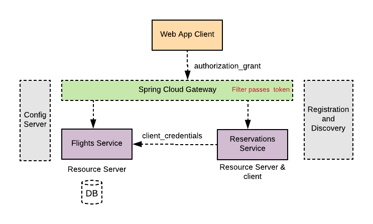
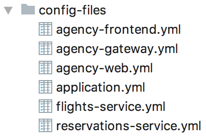

Spring framework provides a comprehensive and extensible authentication
and authorization support. Latest enhancements in Spring 5.x have made it simple
to apply security standards such as OAuth2 to secure applications. In this blog I will
demonstrate how to use OAuth2 second-generation support in Spring framework to
secure a distributed and reactive-based microservices application.

## Architecture
----

A "Flight Agency" demo application will be used in this
blog to illustrate applying the latest Springframework 5.x security features of OAuth2 to
help securing a distributed microservices application. The architecture of the
demo application consists of a front-end web application and a couple
of backend microservices. All modules of the application are implemented using
Spring Boot to take advantage of the auto-configuration and opinionated features.
All applications are also implemented with reactive WebFlux support provided by
Springframework.

As illustrated in the diagram below, the system consists of:

* Front-end Web application implemented using Tymeleaf. The application allows
a user to search for a flight from an origin to a destination within
certain dates, select and book the itinerary flights (called agency-web).

* A back-end service to retrieve available itinerary flights (called flights-service).
* A back-end service to perform reservations and book the itinerary (called reservations-service)

Additionally, the application demo uses common services implemented with Spring
cloud (Spring Boot based), such as:

* A configuration server to externalize and centralize microservices' configurations.
* A registration and discovery service using Spring Cloud Eureka implementation to
help service to register and discover each other.
* A Spring Cloud Gateway, as an edge proxy in front of the two backend services
of flights and reservations.



## Running the Application
----

Before you run the application you need to register a client in one of the OAuth2
/ OpenId Connect providers. Okta can be chosen as a provider for this demo. You can
create a free developer account if you do not have one already by going to okta
developer's [portal] (https://developer.okta.com/). Once logged into okta, register
a new application with authorization_code grant, identify a name and specify the following
parameters in the registration form:

* Login redirect URIs: `http://localhost:8080/login/oauth2/code/okta`
* Initiate Login URI: `http://localhost:8080`

Note down the client ID and client secret provided after you complete the registration.

Register another application but this time with client_credentials grant, specify
a name in the registration form and note the provided client ID and client secret.

* clone the application from github

``` shell
$ git clone https://github.com/Haybu/RA-OAuth2-Gen2.git
```

* Change your working directory to go to "RA-OAuth2-Gen2/config-files" folder, edit
agency-web.yml file and enter the client_id and client secret of the application
registered in okta with authorization_client grant type. Also enter your okta's
account URL on "spring.security.oauth2.provider.okta.*" properties to replace the
host name portions as appropriate.

* On the same folder, edit reservations-service.yml file and enter the client ID
and client secret of the application registered in okta with client_credentials
grant type. Also make sure to supply appropriate URL per your Okta's account on
the security provider's parameters.

* change your working directory back to "RA-OAuth2-Gen2" and run the startup.sh
script file to compile, package and run all application's modules

``` shell
$ ./startup.sh
```

## Application Flow
----

After bringing all modules up, access the web client application by going to
http://localhost:8080. You will be directed to your OAuth2 provider's (in this
case Okta) to authenticate and authorize to the application. Once successfully
logged in, search for a trip intinerary by entering: origin as __AUS__, destination
as __IAH__, departure date as __5/5/2018__ and return date as __5/22/2018__.

The application will display a list of flights, select your outgoing flight. On
the next page pick your returning flight, then click on "book" on the following
page and you will be presented with two confirmation numbers for each flight.

As illustrated in the sequence diagram below, the client application
utilizes a backend "flights service" to provides all available flights per
a search request. Additionally, a "reservations service" is also helping the
client application to perform booking on the selected flights. The client application
and both backend services are implemented using Spring Boot. They all leverage
Spring Cloud configuration server to externalize their configurations, and Spring
Cloud Eureka for services registrations and discoveries. The front-end client
application talks to the backend services via a Spring Cloud Gateway.


## Spring Configuration Server
----

While you can choose from many supported backend to host application configurations,
in this demo a local native file system storage is used to keep all application's
"yml" property files. The configuration files repository, illustrated below, contains
all "yml" files each named after its application name.



Applications bootstrap their configurations by pointing to the configuration
server URL as identified in each application's ./resources/bootstrap.yml file.

## Services Registration and discovery
----

Client application, two backing API services and the gateway application  
register themselves automatically with a Spring Cloud Eureka server when they
spin up. When the client application wants to interact with one of the backend
services it uses a "WebClient" bean that is set with a "LoadBalancerExchangeFilterFunction"
filter to help with balancing out of the discovered target services' instances.

For example, a client application would define a load-balanced "WebClient" bean
as listed below and use that to interact with underneath services discovered
from a Eureka service. Further configuration to the "WebCliet" bean will be
defined further below to help authenticating and access the registered backend
services.

~~~ java
@Bean
 WebClient webClient(LoadBalancerExchangeFilterFunction eff) {
		ServerOAuth2AuthorizedClientExchangeFilterFunction oauth2 =
		      new ServerOAuth2AuthorizedClientExchangeFilterFunction(repo1, repo2);

		return WebClient.builder()
				.filter(eff)
				.build();
 }
~~~

## Spring Cloud Gateway
----

As mentioned above, the web client application communicates with the two backend
micorservices via a Spring Cloud Gateway. The Gateway is configured also in its
"yml" configuration file in the configuration server with all the routes qualified
by a target path to each proxied service. And As shown below, a "RewritePath" filter
is defined to observe the context path of each target service.

~~~ yaml
spring:
  cloud:
    gateway:
      routes:
      - id: flights_service_route
        uri: lb://flights-service
        predicates:
        - Path=/api/flights/**
        filters:
        - RewritePath= /api/flights/(?<segment>.*),/flights/$\{segment}
      - id: reservations_service_route
        uri: lb://reservations-service
        predicates:
        - Path=/api/reservations/**
        filters:
        - RewritePath= /api/reservations/(?<segment>.*),/reservations/$\{segment}
~~~

## Security
----

In this architecture we need to apply OAuth2 security to the client application
and the two backend microservices. New security enhancement in spring 5.x paves
an easy way to secure applications using OAuth2 standards.

### 1. Web Application - OAuth2 Client

You can take advantage
of auto-configuring an OAuth2/Open ID connect clients if you have
"spring-security-oauth2-client" dependency on your classpath. It is even gets
simpler to register as many clients as you desire using properties with
"spring.security.oauth2.client" prefix, and define your provider's properties with
"spring.security.oauth2.provider" prefix.

For instance, in this demo, after the web client application is registered with
one of the OAuth2 / OpenID Connect providers (like Okta), you can configure the
web application with properties that register a client with the a client-id and
client-secret. Also you can define the selected client's provider with information
such as the authorization URI, token URI, user-info URI and JWK set URI. With those
providers who support OpenID Connect discovery, the configuration could be further
simplified by specifying the issuer URI (with "spring.security.oauth2.client.provider.
oidc-provider.issuer-uri" prefix).

~~~ yaml
spring:
  security:
    oauth2:
      client:
        registration:
          okta:
            client-id: {client-id}
            client-secret: {client-secret}
            client-authentication-method: basic
            scope: openid profile email
            authorization-grant-type: authorization_code            
        provider:
          okta:
            authorization-uri: https://[okta-account].oktapreview.com/oauth2/default/v1/authorize
            token-uri: https://[okta-account].oktapreview.com/oauth2/default/v1/token
            user-info-uri: https://[okta-account].oktapreview.com/oauth2/default/v1/userinfo
            user-name-attribute: sub
            jwk-set-uri: https://[okta-account].oktapreview.com/oauth2/default/v1/keys
~~~

The configuration listed above shows many properties for clarity. However, its worth
to note, the framework provides a set of default configured common OAuth2 and
OpenID providers, such as Okta, Google, Facebook, and Github. So the configuration
for Okta above could be simplified as below. Notice, the registered client named
as 'okta' same as the provider name.

~~~ yaml
spring:
  security:
    oauth2:
      client:
        registration:
          okta:     # <-- notice the name here
            client-id: {client-id}
            client-secret: {client-secret}
~~~

### 2. Flights Service - OAuth2 Resource Server

It gets more simpler with the new OAuth2 support in Spring 5.x to configure
a resource server. And exactly as noted in Spring security docuemtnation, if you have "spring-security-oauth2-resource-server" on your classpath, Spring Boot can set up
an OAuth2 Resource Server as long as JWK Set URI or OIDC Issuer URI is specified.

In this demo application, the flight service acts as a resource server and
configured with the below properties. With this set up the client application
can communicate securely with the backend flights service.

~~~ yaml
spring:
  security:
    oauth2:
      resourceserver:
        jwt:        
          issuer-uri: https://[okta-account].oktapreview.com/oauth2/default
~~~          

### 3. Reservations Service - OAuth2 Resource Server and Client

For the front-end client web application to access and communicate with the
reservations service, the reservations service is configured with same properties
as the flights service. However, this reservation service needs at some point to
also communicate with the flights service while booking an itinerary. For that,
the reservations service, besides being a resource server to the web client application,
would need to act as a client to the flights service. A custom "SecurityWebFilterChain"
bean is added to the reservations service to account for configuring it as
a resource server and a client.

~~~ java
@Bean
   public SecurityWebFilterChain securityWebFilterChain(ServerHttpSecurity http) {
       http
               .authorizeExchange()
               .anyExchange().authenticated()
               .and().csrf().disable()
               .oauth2ResourceServer().jwt()
               // becomes a client again to underneath flights service
               .and().and().oauth2Login().and()
               ;

       return http.build();
   }
~~~

Furthermore, the service is also configured with OAuth2 client registration
properties of the previously registered client in Okta with client_credentials
grant type. It is a client_credentials grant type in this case as it is only
needed for a communication between two backend service to service.

~~~ yaml
spring:
  security:
    oauth2:
      client:
        registration:
          okta:
            client-id: {client-id}
            client-secret: {client-secret}
            authorization-grant-type: client_credentials
      resourceserver:
        jwt:          
          issuer-uri: https://[okta-account].oktapreview.com/oauth2/default
~~~


### 4. Spring Cloud Gateway - OAuth2 Resource Server

The Spring Cloud Gateway in this architecture acts also as an edge resource
service to the frontend web application. It is set with the same OAuth2
resource server configuration properties as the other two backend services.
However, as its proxying API requests, it needs to pass through the Authentication
token it receives from the client application as an "Authorization" Bearer header.
A Gateway global filter bean is defined to pass through the bearer token to
underneath proxied services.

~~~ java
public GlobalFilter globalFilter() {
		return (exchange, chain) -> exchange.getRequest().getHeaders()
				.entrySet().stream()
				.filter(entry -> entry.getKey().equals(HttpHeaders.AUTHORIZATION))
				.map(header -> header.getValue())
				.map(bearerToken -> {
					ServerHttpRequest.Builder builder = exchange.getRequest().mutate();
					builder.header(HttpHeaders.AUTHORIZATION, BEARER + bearerToken);
					return builder.build();
				})
				.map(request -> chain.filter(exchange.mutate().request(request).build()))
				.findFirst()
				.orElseThrow(() -> new RuntimeException("Error creating the global filter"))
				;
	}
~~~

## Conclusion
----

The Spring security team at Pivotal made a great and awesome job to help developers
to easily secure clients and resource servers with OAuth2 and OpenID Connect support.
One can easily secure applications using OAuth2 standards with so minimum fuss.
You can have it all configured with just having the appropriate dependency and
right OAuth2 configuration properties for the registered client, resource server
or optionally a provider.

## Resources
----

* Sample Demo application Code in [Github](https://github.com/Haybu/RA-OAuth2-Gen2)
* Spring Security [Documentation](https://docs.spring.io/spring-boot/docs/current/reference/html/boot-features-security.html)
