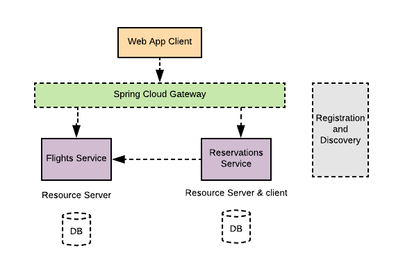
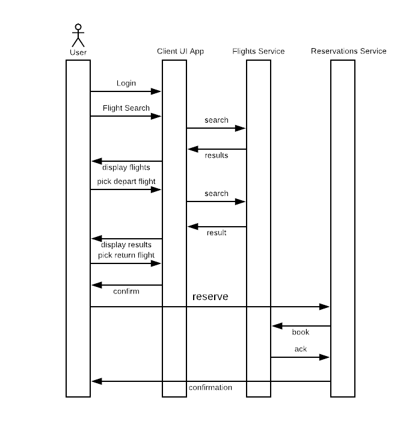

Spring framework provides a comprehensive and extensible authentication
and authorization support. Latest enhancements in Spring 5.x have made it simple
to apply security standards such as OAuth2 to secure applications. In this blog I will
demonstrate leveraging second-generation of OAuth2 support in Springframework
security in a distributed and reactive-based microservices application.

## Architecture
----

A Spring-based simulation of a flight reservation web application is created for this
blog to illustrate applying the latest Springframework 5.x security features to
secure a distributed microservices application. The architecture of the
demonstrating application consists of a front-end web application and a couple
of backend microservices. All modules of the application are implemented using
Spring Boot to take advantage of the auto-configuration features to setup the application.
All Services in the application are implemented with reactive WebFlux support provided by
Springframework.

As illustrated in the diagram below, the system consists of:

* Front-end Web application implemented using Thymeleaf. The application allows
a user to search for a flight from an origin to a destination within
certain dates, select and book the itinerary. The module is named as agency-web.

* A back-end service to retrieve available itinerary flights, named as flights-service.
* A back-end service to perform reservations and book the itinerary, named as reservations-service.

Additionally, the application uses common Spring Cloud services such as:

* A registration and discovery service using Spring Cloud Eureka implementation to
help services to register and discover each other.
* A Spring Cloud Gateway  in front of the flights and reservations backend services.



## Running the Application
----

Follow the steps below to run the application:

* clone the application from github

``` shell
$ git clone https://github.com/Haybu/RA-OAuth2-Gen2.git
```

* Build the application from the project home directory

``` shell
 $ mvn clean install
```

* Launch the UAA authorization server.

``` shell
$ ./uaa-server/gradlew -b ./uaa-server/build.gradle uaa
```

* Bring up all services by running the shell script startup.sh

``` shell
$ ./startup.sh
```

## Application Flow
----

After bringing all modules up, access the web application at
http://localhost:8080. You will be redirected to the OAuth2 authorization server
(UAA) to authenticate and authorize to the application. Once successfully
logged in, search for a trip itinerary by entering: origin as __AUS__, destination
as __IAH__, departure date as __5/5/2018__ and return date as __5/22/2018__.

The application will display a list of flights, select an outbound flight, an
inbound flight, review select seletected flights and click on "book" button. The
application will display a reservation confirmation number for each flight.

As illustrated in the sequence diagram below, the client application
utilizes a backend "flights service" to search for available flights per a user
search request. Additionally, a "reservations" backend service is also helping a
client to book the selected flights. The client application
and both backend services are implemented using Spring Boot. They all leverage
Spring Cloud Eureka for services registrations and discoveries. The front-end client
application talks to the backend services via a Spring Cloud Gateway.



## Services Registration and discovery
----

Client application, the two backend API services and the gateway application  
all register themselves automatically with a Spring Cloud Eureka server when they
spin up. The client application uses a "WebClient" bean to interact with any of the backend
services. The "WebClient" beans are configured with a "LoadBalancerExchangeFilterFunction"
filter to help with balancing out between the discovered target services' instances.

For example, a client application defines a load-balanced "WebClient" bean
as listed below and uses that to interact with underneath discovered gateway
from a Eureka service.

~~~ java
@Bean
	WebClient webClient(LoadBalancerExchangeFilterFunction eff,
			ReactiveClientRegistrationRepository repo1,
			ServerOAuth2AuthorizedClientRepository repo2)
	{
		ServerOAuth2AuthorizedClientExchangeFilterFunction oauth2 =
				new ServerOAuth2AuthorizedClientExchangeFilterFunction(repo1, repo2);
		return WebClient.builder().filter(eff).filter(oauth2).build();
	}
~~~

## Spring Cloud Gateway
----

The web client application communicates with the two backend
micorservices via a Spring Cloud Gateway. The Gateway is configured to
route based on the target's path to each proxied backend service.
And As shown below, a "RewritePath" filter
is defined to observe the context path to each target service.

~~~ yaml
spring:
  cloud:
    gateway:
      routes:
      - id: flights_service_route
        uri: lb://flights-service
        predicates:
        - Path=/api/flights/**
        filters:
        - RewritePath= /api/flights/(?<segment>.*),/flights/$\{segment}
      - id: reservations_service_route
        uri: lb://reservations-service
        predicates:
        - Path=/api/reservations/**
        filters:
        - RewritePath= /api/reservations/(?<segment>.*),/reservations/$\{segment}
~~~

## Security
----

In this architecture we need to apply Spring security to the client application
and the two backend microservices. New security enhancement in spring 5.x paves
the way to seamlessly secure applications using OAuth2 standards.

### Web Application - OAuth2 Client

You can take advantage of auto-configuring clients with Spring Security if you have
"spring-security-oauth2-client" dependency in your classpath. It is even getting
simpler to register as many clients as you desire using properties with
"spring.security.oauth2.client" prefix, and define your provider's properties with
"spring.security.oauth2.provider" prefix.

For instance, in this sample, after the web client application is registered with
one of the OAuth2 / OpenID Connect providers (like UAA), you can configure the
web application with properties to register a client using the a client-id and
client-secret. Also you can define the selected client's provider with information
such as the authorization URI, token URI, user-info URI and JWK set URI. With those
providers who support OpenID Connect discovery, the configuration could be further
simplified by specifying the issuer URI (with "spring.security.oauth2.client.provider.
oidc-provider.issuer-uri" prefix).

The configuration listing above shows an example of properties used to register
a client and a provider.

~~~ yaml
spring:
  security:
    oauth2:
      client:
        registration:
          login-client:
            client-id: login-client
            client-secret: secret
            client-authentication-method: basic
            scope: openid,profile,email
            authorization-grant-type: authorization_code
            client-name: Login Client
            redirect-uri-template: "{baseUrl}/login/oauth2/code/{registrationId}"
            provider: uaa            
        provider:
          uaa:
            authorization-uri: http://localhost:8099/uaa/oauth/authorize
            token-uri: http://localhost:8099/uaa/oauth/token
            user-info-uri: http://localhost:8099/uaa/userinfo
            user-name-attribute: sub
            jwk-set-uri: http://localhost:8099/uaa/token_keys
~~~

### Reservations Service and Flights Service as Resource Servers

You can designate and configure a resource server in Spring Security 5.x by
having "spring-security-oauth2-resource-server" in your classpath. Spring Boot
can set up an OAuth2 Resource Server as long as JWK Set URI or OIDC Issuer URI
is specified.

For example, the flight service acts as a resource server and is
configured using the properties below. With this setup the client application
can communicate securely with the backend flights service.

~~~ yaml
spring:
  security:
    oauth2:
      resourceserver:
        jwt:
          jwk-set-uri: http://localhost:8099/uaa/token_keys
~~~

### Spring Cloud Gateway

The Spring Cloud Gateway in this architecture acts as an API gateway
service to the frontend web application. It routes traffic to targeted backend microservices.
Spring Cloud Gateway passes through the Authentication
token it receives from the client application as an "Authorization" Bearer header.

## Conclusion
----

The Spring security team at Pivotal made significant improvements
to secure client and resource server applications with Spring Security 5.x.
One can easily secure applications using OAuth2 standards with so minimum fuss.
You can get it all configured by specifying the appropriate security dependencies
and configuration properties to configure a client, resource server
or optionally a provider.

## Resources
----

* Sample Demo application Code in [Github](https://github.com/Haybu/RA-OAuth2-Gen2)
* Spring Security [Documentation](https://docs.spring.io/spring-boot/docs/current/reference/html/boot-features-security.html)
